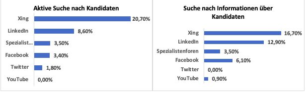

# DIE BEDEUTUNG VON SOCIAL MEDIA FÜR DAS RECRUITING VON UNTERNEHMEN

#

## Einleitung

Facebook, Twitter, Xing, LinkedIn, YouTube, kununu, oder Karriere-Blogs – der “war for talents“ fordert von Unternehmen sich als attraktiver Arbeitgeber in sozialen Netzwerken zu präsentieren und aktiv nach geeignetem Personal zu suchen (Schäfer & Fink, 2017, S. 359). In diesem Zusammenhang wird im vorliegenden Paper die Frage „Welche Relevanz hat Social Media für das Recruiting von Unternehmen“ behandelt. Dafür wird zunächst die Problemstellung geschildert, ein Überblick zum aktuellen Stand des Recruitings auf Social Media gegeben, anschließend die Chancen und Risiken betrachtet und ein Fazit abgegeben.

## Generation Y und ihr Bewerberverhalten

Demografischer Wandel, Globalisierung und Fachkräftemangel erschweren es vielen Unternehmen geeignete Bewerber zu finden und langfristig an das Unternehmen zu binden. Auch die Art und Weise der Kommunikation zwischen Bewerbern und Unternehmen hat sich in letzter Zeit stark verändert (Dannhäuser, 2017, S. 2). Aktuell drängt die Generation Y auf den Arbeitsmarkt – die erste Generation, die weitestgehend mit dem Internet und sozialen Netzwerken aufgewachsen ist und sich in ihren Denkmustern, Werten und Verhaltensweisen stark von vorherigen Generationen unterscheidet (Schulenburg, 2016, S. 1). Sie organisiert sich weltweit über das Internet und tauscht sich auf sozialen Netzwerken zu privaten, aber auch beruflichen Themen aus. Dies führt dazu, dass Unternehmen ihre Informationshoheit verlieren, d.h. sie haben nicht mehr die Macht darüber wie, wann, wo und vor allem was über das Unternehmen gesprochen wird (Bärmann, 2012, S. 15). Die Folge ist ein verändertes Bewerberverhalten aufgrund von verschobenen Machtverhältnissen im Bewerbungsprozess. Die Übermacht der Arbeitgeber gehört der Vergangenheit an und die Bewerber haben die Auswahl, was dazu führt, dass Unternehmen in sozialen Netzwerken im „war for talents“ um die besten Mitarbeiter buhlen (Dannhäuser, 2017, S. 3). Laut einer Studie der Universität RheinMain beziehen sich die Hauptziele des Social Media Einsatz von Unternehmen aus diesen Gründen auf die Themen Employer Branding und Recruiting (Petry, 2018, S.14).

## Vom „Post and Pray“ zum „aktiven Recruiting“ in sozialen Netzwerken

Der Begriff Social Media „bezeichnet digitale Medien und Technologien, die es Nutzern ermöglichen, sich untereinander auszutauschen und mediale Inhalte einzeln oder gemeinschaftlich zu gestalten“ (Petry & Jäger, 2018, S. 35).
In den letzten Jahren hat sich das Internet, vor allem durch Social Media von einer Informations- in eine Interaktionsplattform gewandelt. Soziale Netzwerke unterstützen die Informationsbereitstellung, die Pflege sozialer Beziehungen, den kommunikativen Austausch und die soziale Interaktion vieler User (Schmidt & Taddicken, 2017, S. 5). Die vielen verschiedenen Social Media Plattformen lassen sich vereinfacht zu folgenden Kategorien zusammenfassen: Social Networks (z.B. Facebook, Xing), Wikis (z.B. Wikipedia), Blogs, Microblogs (z.B. Twitter) und Social Sharing Plattformen (z.B. kununu) (Petry & Jäger, 2018, S. 36).

Aufgrund des sich ändernden Bewerberverhaltens ist die Rekrutierung von Fachkräften über Social Media für Unternehmen essenziell geworden, um im „war for talents“ nicht leer auszugehen. Zusammen mit den anfangs beschriebenen veränderten Rahmenbedingungen müssen Unternehmen bereits einen entscheidenden Wandel im Social Media Recruiting berücksichtigen: Während früher auf eine Stellenausschreibung häufig eine Bewerbungsflut folgte, müssen Personaler heutzutage deutlich kreativer und aktiver in ihren Personalbeschaffungsmaßnahmen werden (Rechsteiner, 2019, S. 34). Ein erfolgreiches Social Media Recruiting umfasst daher drei wichtige Strategien: Employer Branding, Active Sourcing und Screening (Schäfer & Fink, 2017, S. 359-362). Das Employer Branding – die Pflege und die aktive Gestaltung der eigenen Arbeitnehmermarke - ist für Unternehmen im Kampf um die besten Mitarbeiter unumgänglich. Für ein erfolgreiches Employer Branding muss der Arbeitgeber zeigen, wofür er steht, was ihn einzigartig macht und welche Mitarbeiter zu ihm passen, um möglichst die Qualität der Bewerber zu erhöhen und gleichzeitig die vorhandenen Mitarbeiter ans Unternehmen zu binden (Rehm, 2014, S. 19-20). In diesem Zusammenhang ist es interessant zu betrachten, auf welchen sozialen Netzwerken die Unternehmen ihre Employer Branding Kampagnen und Stellenanzeigen veröffentlichen und welche Kanäle die Kandidaten nutzen, um dies zu empfangen. Laut einer Studie der Universität Bamberg nutzen die Top 1000 Unternehmen am häufigsten Xing, Facebook und LinkedIn zur Veröffentlichung ihrer Stellenanzeigen. Zur Schaltung von Image Werbung verwenden die meisten Unternehmen Facebook. Hinzu kommen neuere Kanäle wie Instagram oder Snapchat. Während Instagram von 24,4% der Top 1000 Unternehmen zur Veröffentlichung von Image-Werbung genutzt wird, spielt Snapchat nur eine untergeordnete Rolle (siehe Abbildung 1) (Universität Bamberg, 2019, S. 19).

**Abbildung 1: Häufige Nutzung der Social-Media-Kanäle durch Unternehmen für die Veröffentlichung von Stellenanzeigen und Image-Werbung**

Quelle: Universität Bamberg, 2019, S. 19

Im Vergleich dazu zeigt die nachfolgende Abbildung 2, dass Kandidaten bei der Suche nach Stellenangeboten hauptsächlich auf Karrierenetzwerke wie Xing und LinkedIn, Facebook und Spezialistenforen zurückgreifen. Auch hier sind Instagram und Snapchat für die meisten Nutzer uninteressant (Universität Bamberg, 2019, S. 20).

**Abbildung 2: Häufige Nutzung von Social-Media-Kanälen durch Kandidaten zur Suche nach Stellenangeboten**

Quelle: Universität Bamberg, 2019, S. 20

Im Rahmen von Active Sourcing, der zweiten wichtigen Strategie im Social Media Recruiting, suchen Personaler selbst nach einem passenden Bewerber. Die verfügbaren Fachkräfte stehen nicht selten in einem festen, ungekündigten Arbeitsverhältnis, weshalb es gilt diese ausfindig zu machen, anzusprechen, von sich als Arbeitgeber zu überzeugen, zu einer Vertragsunterschrift zu bewegen und möglichst zu binden. Einzige Voraussetzung bei der aktiven Kandidatenansprache ist, dass der potenzielle Mitarbeiter mit mindestens einem Profil in einem sozialen Netzwerk präsent ist (Dannhäuser, 2017, S. 3). Während das Employer Branding und das Active Sourcing hauptsächlich auf die Generierung von Bewerbungen abzielt, kommt das Screening hinzu, wenn bereits Bewerbungen vorliegen. Screening kann als eine Art „Pre-Employment Check“ verstanden werden, bei dem gezielt Informationen zu bereits identifizierten Kandidaten in sozialen Netzwerken gesucht werden. Das Screening bildet somit einen Selektionsmechanismus, um aus einem Bewerberpool den richtigen Kandidaten auszuwählen (Schäfer & Fink, 2017, S. 359-362). Auch hier wird im Folgenden betrachtet in welchen sozialen Netzwerken die Unternehmen nach potenziellen Mitarbeitern suchen und in welchen sozialen Netzwerken sich Nutzer hingegen mit Unternehmen vernetzen. Abbildung 3 zeigt, dass Unternehmen am häufigsten in Netzwerken wie Xing und LinkedIn, gefolgt von Spezialistenforen, Blogs, und Facebook aktiv nach potenziellen Mitarbeitern suchen. Zum Screening bereits identifizierter Kandidaten werden hauptsächlich Karrierenetzwerke und Facebook verwendet.

**Abbildung 3: Anteil an Unternehmen, der Social Media zur aktiven Suche nach Kandidaten nutzt**

Quelle: Universität Bamberg, 2019, S. 21

Zur Vernetzung mit Unternehmen nutzen Kandidaten ebenfalls am häufigsten Karrierenetzwerke, gefolgt von Facebook und Spezialistenforen (Abbildung 4). Ebenso verhält es sich beim Empfang von Werbeanzeigen für Jobs.

**Abbildung 4: Anteil an Kandidaten, der häufig Social Media Kanäle zur Vernetzung mit Unternehmen und zum Empfang von Werbung für Stellenanzeigen nutzt**

Quelle: Universität Bamberg, 2019, S. 21

## Chancen und Herausforderungen

Im Folgenden werden Probleme, Risiken und Chancen des Social Media Recruitings sowie weiterführende Recruiting Trends beleuchtet.
Einige Arbeitgeber sehen in der Nutzung von Social Media im Personalbeschaffungsbereich die Gefahr eines Kontrollverlustes über die eigene Arbeitgebermarke und befürchten, dass negative Kommentare zu Imageschäden oder einer Art „Shitstorm“ führen könnten. Die Folge ist oftmals eine fehlende Präsenz in Social Media, was jedoch nicht zur Lösung des Problems beiträgt, da negative Kommentare auch ohne das Zutun des Arbeitgebers entstehen (Rehm, 2014, S.45). Ein weiteres Risiko besteht darin, den personellen und zeitlichen Aufwand einer Social Media Strategie zu unterschätzen. Da Unternehmen mit einer expliziten Social-Media Strategie fast doppelt so erfolgreich im Active Sourcing sind (Universität Bamberg, 2019, S. 21), sind hier qualifizierte Mitarbeiter, die für die Pflege und Inhalte der jeweiligen Social Media Kanäle verantwortlich sind, ein schriftlich fixierter Social Media Kodex und ein Redaktionsplan in Abstimmung mit Verantwortlichen für andere Personalbeschaffungsmaßnahmen von essenzieller Bedeutung (Universität Bamberg, 2019, S. 18). Hinzu kommt der Fakt, dass Social Media Kanäle im Recruiting zwar eine wichtige Rolle spielen, sich entgegen der Erwartungen allerdings nicht so entwickelt haben wie prognostiziert. Seit Jahren bilden die Top 3 Kanäle zur Kandidatenansprache Online-Stellenbörsen, Karrierewebseiten und Mitarbeiterempfehlungen. Auch wenn sich diese Platzierung in nächster Zeit nicht ändern wird, wollen viele Unternehmen zukünftig stärker in die Bereiche Active Sourcing und Social Media investieren (Jäger & Meurer, 2018, S.4).
Dennoch bietet der Bereich der aktiven Mitarbeiteransprache Chancen für Unternehmen, da so Kandidaten erreicht werden, die durch klassische Rekrutierungsmaßnahmen nicht erreicht werden würden. Im Schnitt wechseln ca. 2 von 10 Kandidaten durch Direktansprache ihren Job, obwohl sie nicht auf Stellensuche sind (Universität Bamberg, 2019, S. 31). Eine weitere Chance für das Social Media Recruiting besteht im mobilen Recruiting, da ca. 50% der Suchanfragen nach Stellen von mobilen Endgeräten geschieht. Auch wenn Stellenanzeigen und Karriereseiten häufig bereits mobil optimiert sind, hinken die mobilen Bewerbungsmöglichkeiten noch deutlich hinterher (Petry & Jäger, 2018, S. 65). Ferner besteht ein weiterer Trend im Recruiting via Social Games, bei dem qualifizierte Talente eine Art E-Assessment über leicht zugängliche Spiele absolvieren und so eine Art Potenzialanalyse stattfinden kann. Geeignete Talente werden anschließend zu einer Bewerbung animiert (Rehm, 2014, S.48). Hinzu kommt der Trend hoher Rationalisierungspotenziale im Recruiting durch intelligente Chatbots, Matchingtools und Robot Process Automation. Der Kernprozess des Recruitings wird in den kommenden Jahren wahrscheinlich viel mehr von KI, Algorithmen und weiteren Softwareprogrammen übernommen (Petry & Jäger, 2018, S. 66). Momentan kommt dies erst selten zum Einsatz und im Schnitt kennt sich nur jeder zweite Personaler mit den neuen HR-Möglichkeiten aus (Jäger & Meurer, 2018, S.4).

## Fazit

Abschließend lässt sich festhalten, dass Social Media Recruiting sinnvoll ist, allerdings nicht als alleinige Personalbeschaffungsmaßnahme betrieben werden sollte.
Die einzelnen Social Media Kanäle werden von Kandidaten und Unternehmen größtenteils für die gleichen Zwecke verwendet, weshalb die Veröffentlichung von Stellenanzeigen, Image-Werbung oder die aktive Suche nach Kandidaten in sozialen Netzen sinnvoll ist. Trotzdem bleiben die Hauptkanäle der Kandidatenansprache Online-Stellenportale, Mitarbeiterempfehlungen und Karrierewebseiten, weshalb diese fokussiert werden sollten und durch Social Media Recruiting bzw. Employer-Branding Maßnahmen in sozialen Netzwerken unterstützt werden sollten.

## Literaturverzeichnis

Bärmann, Frank (2012): Social Media im Personalmanagement. Facebook, Xing, Blogs, Mobile Recruiting und Co. Erfolgreich einsetzen. Heidelberg et al.: mitp-Verlag.

Dannhäuser, Ralph (2017): Praxishandbuch Social Media Recruiting. Experten Know How/Praxistipps/Rechtshinweise (3. Auflage). Wiesbaden: Springer Gabler.

Jäger, Wolfgang und Meurer, Sebastian (2018): Recruiting Strategien 2018. Erfolgreiche Instrumente zur Bewerbersuche. Köln: Wolters Kluwer Deutschland GmbH. [Link](05.pdf)

Otto-Friedrich-Universität Bamberg (Hrsg.) (2019): Social Recruiting und Active Sourcing. Ausgewählte Ergebnisse der Recruiting Trends 2019. Bamberg: Otto-Friedrich-Universität Bamberg. [Link](04.pdf)

Petry, Thorsten (2018): Social Media Personalmarketing Studie 2018 (5. Auflage). Wiesbaden und Rüsselsheim: Hochschule RheinMain University of Applied Sciences Wiesbaden Rüsselsheim. [Link](03.pdf)

Petry, Thorsten und Jäger, Wolfgang (2018): Digital HR. Smarte und agile Systeme, Prozesse und Strukturen im Personalmanagement (1. Auflage). Freiburg, München, Stuttgart: Haufe Group.

Rechsteiner, Frank (2019): Active Sourcing, Content Recruiting & Cultural Fit. Wissensmanagement. 04/2019. 34-36. [Link](02.pdf)

Rehm, Florian (2014): Web 2.0 im Bereich Personalbeschaffung. In Reiner Bröckermann (Hrsg.), Praxisorientierte Personal- und Organisationsforschung. München und Mering: Rainer Hampp Verlag.

Schäfer, Lisa Carolin und Fink, Miriam Sophie (2017): E-Recruiting. Hype oder Wunderwaffe?. Arbeit und Arbeitsrecht. 6. 359-362. [Link](01.pdf)

Schmidt, Jan-Hinrik und Taddicken, Monika (2017): Handbuch Soziale Medien. Wiesbaden: Springer VS.

Schulenburg, Nils (2016): Führung einer neuen Generation. Wie die Generation Y führen und geführt werden sollte. Wiesbaden: Springer Gabler

[Mein bester Professor](https://ulrich-anders.eu)
